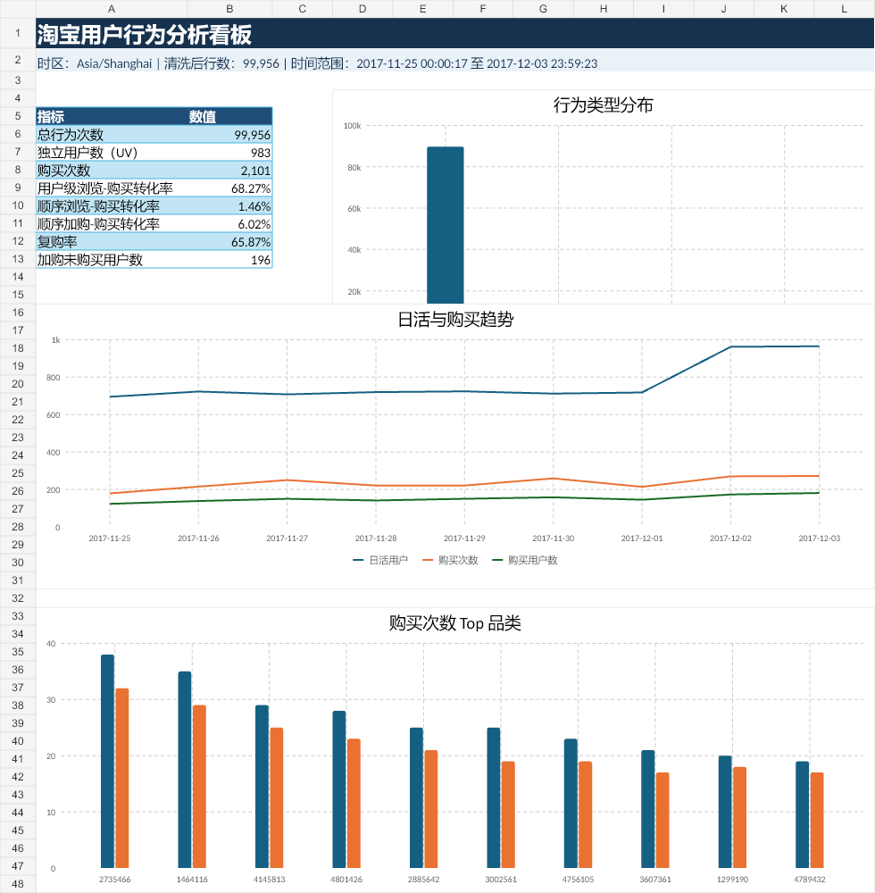

# Taobao User Behavior & Conversion Funnel Analysis

淘宝用户行为与转化漏斗分析项目

## 项目概览

本项目基于公开淘宝 `UserBehavior.csv` 数据集抽取的真实样本，构建电商用户行为与转化漏斗分析流程。项目覆盖数据清洗、数据质量检查、SQL 分析、用户转化漏斗、品类转化、复购行为、用户分层和 Excel 看板展示，适合作为数据分析、数据运营、产品运营实习岗位的简历项目。

当前提交的数据文件来自下载后的 `archive.zip` / `UserBehavior.csv`，抽取 100,000 行真实行为记录。按 `Asia/Shanghai` 业务时区清洗后，共保留 99,956 条有效行为记录用于分析。

数据集来源：[Alibaba Tianchi Taobao UserBehavior Dataset](https://tianchi.aliyun.com/dataset/649?lang=en-us)。

## 看板预览

项目已包含 Excel 看板文件：`dashboard/taobao_behavior_dashboard.xlsx`。



## 分析问题

- 整体用户行为规模如何，包括总行为次数、UV、商品数和品类数？
- 浏览、收藏、加购、购买四类行为如何分布？
- 用户级浏览-购买转化率是多少？
- 更严格的用户-商品级顺序转化率是多少？
- DAU 和购买次数随日期如何变化？
- 按北京时间统计，哪些小时用户活跃度和购买行为更高？
- 哪些商品品类贡献了最多购买次数？
- 哪些品类既有一定流量规模，又有较强转化效率？
- 是否存在复购用户，高价值用户是否集中？
- 有多少用户加购后没有购买，是否适合作为再营销人群？

## 数据集说明

数据来源为阿里天池公开淘宝用户行为数据集 `UserBehavior.csv`。原始文件没有表头，共 5 个字段：

| 字段 | 说明 |
| --- | --- |
| `user_id` | 脱敏后的用户 ID |
| `item_id` | 脱敏后的商品 ID |
| `category_id` | 脱敏后的商品品类 ID |
| `behavior_type` | 用户行为类型：`pv`、`fav`、`cart`、`buy` |
| `timestamp` | Unix 时间戳 |

行为类型映射：

| behavior_type | English | 中文 |
| --- | --- | --- |
| `pv` | page view | 浏览 |
| `fav` | favorite | 收藏 |
| `cart` | add to cart | 加购 |
| `buy` | purchase | 购买 |

## 技术栈

- Python
- Pandas
- Matplotlib / Seaborn
- PostgreSQL SQL
- Jupyter Notebook
- Excel dashboard

## 项目结构

```text
Taobao-User-Behavior-Conversion-Analysis/
|-- README.md
|-- requirements.txt
|-- data/
|   |-- README.md
|   |-- raw_user_behavior_sample.csv
|   `-- cleaned_user_behavior.csv
|-- notebooks/
|   `-- 01_data_cleaning_eda.ipynb
|-- sql/
|   |-- README.md
|   `-- taobao_behavior_analysis.sql
|-- reports/
|   |-- analysis_summary.md
|   |-- business_insights.md
|   |-- data_quality_report.md
|   |-- resume_project_review.md
|   |-- dashboard_data.json
|   `-- figures/
|       |-- behavior_distribution.png
|       |-- daily_trends.png
|       |-- hourly_behavior_heatmap.png
|       `-- top_categories_purchase.png
|-- dashboard/
|   |-- dashboard_design.md
|   |-- dashboard_preview.png
|   `-- taobao_behavior_dashboard.xlsx
|-- screenshots/
|   `-- README_screenshot_placeholder.md
`-- src/
    |-- data_cleaning.py
    |-- analysis.py
    |-- generate_reports.py
    |-- prepare_real_data_sample.py
    `-- generate_sample_data.py
```

## 数据清洗流程

清洗脚本同时支持官方无表头 `UserBehavior.csv` 和本项目中已抽取的带表头样本 CSV。

清洗逻辑：

1. 读取原始行为 CSV。
2. 删除重复记录。
3. 删除必要字段缺失的记录。
4. 将 ID 字段和时间戳转换为数值类型。
5. 统一并校验行为类型。
6. 将 Unix 时间戳转换为 `Asia/Shanghai` 本地业务时间。
7. 过滤分析窗口外的异常日期。
8. 构建 `date`、`hour`、`weekday` 字段。
9. 映射中英文行为名称。
10. 导出 `data/cleaned_user_behavior.csv`。

## 核心指标

当前真实样本结果：

| 指标 | 数值 |
| --- | ---: |
| 原始行数 | 100,000 |
| 清洗后行数 | 99,956 |
| 独立用户数（UV） | 983 |
| 商品数 | 64,440 |
| 品类数 | 3,128 |
| 浏览次数（PV） | 89,665 |
| 收藏次数 | 2,744 |
| 加购次数 | 5,446 |
| 购买次数 | 2,101 |
| 用户级浏览-购买转化率 | 68.27% |
| 用户级加购-购买转化率 | 72.89% |
| 用户-商品级顺序浏览-购买转化率 | 1.46% |
| 用户-商品级顺序加购-购买转化率 | 6.02% |
| 复购率 | 65.87% |
| 加购未购买用户数 | 196 |

分析覆盖：

- 总行为次数、UV、商品数、品类数
- 行为类型分布和行为占比
- 清洗前后数据质量检查
- 用户级转化漏斗
- 带时间顺序约束的用户-商品级转化漏斗
- DAU 和每日购买趋势
- `Asia/Shanghai` 口径下的小时行为分布
- 购买次数 Top 品类
- 品类级浏览-购买、加购-购买转化率
- 复购率
- 加购未购买用户
- 高价值用户
- 按行为深度和购买频次划分的用户分层

## SQL 分析

`sql/taobao_behavior_analysis.sql` 包含以下 PostgreSQL 查询：

- 整体行为规模
- 行为类型分布和占比
- DAU
- 每日购买次数和购买用户数
- 小时行为分布
- Top 10 购买品类
- 浏览-购买转化率
- 加购-购买转化率
- 收藏-购买转化率
- 复购率
- 加购未购买用户
- 高价值用户
- 基于 CTE 的用户漏斗
- 使用窗口函数计算每日购买 Top 品类
- 带时间顺序约束的用户-商品级漏斗
- 品类级转化分析

## 看板和报告

看板产物：

- `dashboard/taobao_behavior_dashboard.xlsx`：Excel 看板文件。
- `dashboard/dashboard_preview.png`：看板预览图。
- `dashboard/dashboard_design.md`：看板设计说明。

生成报告：

- `reports/data_quality_report.md`：数据质量检查和清洗影响。
- `reports/analysis_summary.md`：核心指标、严格漏斗、品类转化和用户分层。
- `reports/business_insights.md`：面向业务动作的分析洞察和验证指标。
- `reports/figures/`：可用于 README、报告或展示材料的图表图片。

## 业务洞察

当前真实样本的关键发现：

- 浏览量明显高于购买量：PV 占有效行为的 89.70%，购买行为占 2.10%。
- 用户级转化率较高，但更严格的用户-商品级顺序转化率明显更低，说明整体人群转化和具体商品路径转化需要分开解释。
- 加购用户是强意向人群：用户级加购-购买转化率为 72.89%，用户-商品级顺序加购-购买转化率为 6.02%。
- 时间戳转换为 `Asia/Shanghai` 后，购买高峰小时为 13:00。
- 当前样本中 DAU 和购买次数均在 2017-12-03 达到高峰。
- 品类 `2735466` 的购买次数排名第一。
- 复购用户占购买用户的 65.87%。
- 196 名加购未购买用户可作为再营销候选人群。

## How to Run

Create and activate a virtual environment:

```bash
python -m venv .venv
.venv\Scripts\activate
pip install -r requirements.txt
```

The repository already includes a 100,000-row real sample. To regenerate a small synthetic sample only for testing:

```bash
python src/generate_sample_data.py --rows 5000
```

To rebuild the real public dataset sample, download `UserBehavior.csv` from Tianchi or the Kaggle mirror, put it under `data/UserBehavior.csv`, and extract a GitHub-friendly real sample:

```bash
python src/prepare_real_data_sample.py --input data/UserBehavior.csv --output data/raw_user_behavior_sample.csv --rows 100000
```

For a less biased sample, use fixed-seed random sampling:

```bash
python src/prepare_real_data_sample.py --input data/UserBehavior.csv --output data/raw_user_behavior_sample.csv --rows 100000 --sample-mode random --random-state 42
```

If the downloaded file is `UserBehavior.csv.zip`, you can use it directly without extracting the full CSV:

```bash
python src/prepare_real_data_sample.py --input data/UserBehavior.csv.zip --output data/raw_user_behavior_sample.csv --rows 100000 --sample-mode random --random-state 42
```

Clean the selected raw sample:

```bash
python src/data_cleaning.py --input data/raw_user_behavior_sample.csv --output data/cleaned_user_behavior.csv
```

Run Pandas analysis:

```bash
python src/analysis.py --input data/cleaned_user_behavior.csv
```

Regenerate markdown reports and chart images:

```bash
python src/generate_reports.py
```

Analyze the full Tianchi dataset directly if your machine has enough memory and storage:

```bash
python src/data_cleaning.py --input data/UserBehavior.csv --output data/cleaned_user_behavior.csv
python src/analysis.py --input data/cleaned_user_behavior.csv
python src/generate_reports.py
```

## Future Improvements

- Add a native Power BI `.pbix` version of the dashboard.
- Add cohort analysis by first purchase date.
- Add RFM-style user segmentation based on frequency and recency.
- Add automated table exports for SQL query results.
- Expand pytest coverage for edge cases and empty datasets.

## Resume Bullet Points 中文简历写法参考

淘宝用户行为与转化漏斗分析项目｜个人项目｜Python / Pandas / PostgreSQL / SQL / Excel

- 基于淘宝 UserBehavior 公开数据集，构建电商用户行为与转化漏斗分析项目，分析浏览、收藏、加购、购买等行为路径。
- 使用 Pandas 完成数据清洗、北京时间转换、异常时间过滤和行为标签构建，沉淀可复现的数据处理与报告生成脚本。
- 通过 SQL 和 Pandas 统计用户规模、行为分布、用户级转化率、用户-商品级顺序转化率、复购率和加购未购买用户。
- 使用 CTE、CASE WHEN、GROUP BY 和窗口函数分析 DAU、购买趋势、品类购买排名、复购用户和高价值用户。
- 构建 Excel 看板展示核心 KPI、行为分布、DAU 趋势、购买趋势、Top 品类和用户分层，并输出面向运营动作的业务洞察。
